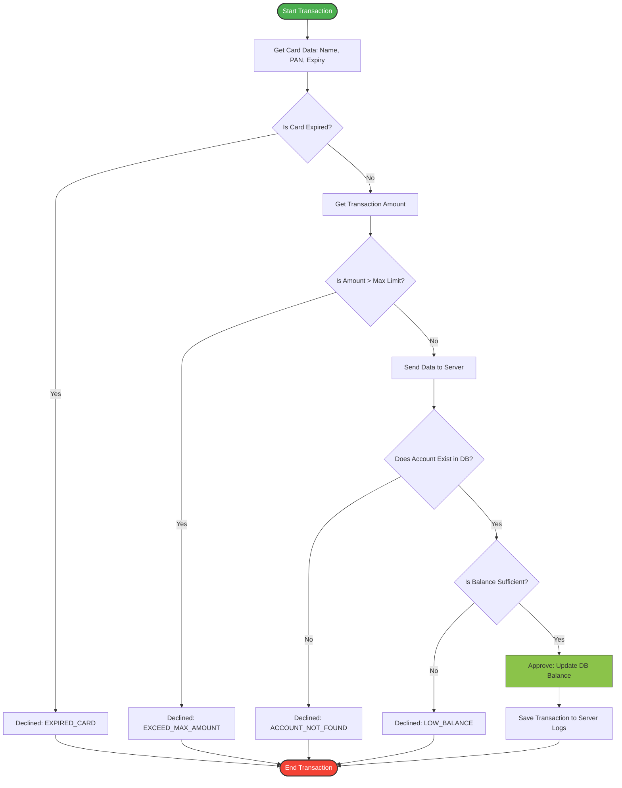

# 💳 Payment Application (Embedded Systems C Project)

A highly structured, modular **C-based Payment System** simulating a real-world credit card transaction environment. This project demonstrates strict adherence to industrial C-programming standards, defensive programming, structural modularity, and data validation techniques crucial for **Embedded Systems** and automotive software development.

---

## 🛠️ Used Technologies & Systems Concepts
- **Programming Language:** ANSI C (100%) - Employing strict static memory allocation and defensive design.
- **Development Environment:** Microsoft Visual Studio (MSVC Compiler).
- **Embedded C Concepts Applied:**
  - **Modular Architecture:** Complete decoupling between layers via abstract interfaces.
  - **Custom Data Types:** Intensive usage of standard typedefs, custom structs, and type-safe `enums` for function state returns.
  - **Defensive Programming:** Input null-pointer checking, string boundary limits, and strict value range constraints.
  - **Memory Optimization:** Avoidance of dynamic memory allocation (`malloc`) to ensure predictable run-time behavior.

---

## 📁 Project Structure (Architecture)

The repository follows a clean layered structure grouping related code components together:

```text
paymentApplication/
├── Project1/
│   ├── Card/               # Card Module (Data Acquistion)
│   │   ├── card.c          # Implementation of card operations
│   │   └── card.h          # Card structure & prototypes
│   ├── Terminal/           # Terminal Module (Validation Logic)
│   │   ├── terminal.c      # Verification of expiry, amounts & limits
│   │   └── terminal.h      # Terminal parameters & configurations
│   ├── Server/             # Server Module (Data Center & DB)
│   │   ├── server.c        # Account validation, balance updates & logging
│   │   └── server.h        # Server state definitions & DB layout
│   ├── Application/        # Application Layer (Orchestration)
│   │   ├── app.c           # Master flow control sequence
│   │   └── app.h           # Main program interface
│   ├── main.c              # Application Entry Point
│   └── .gitignore          # Excludes build artifacts (obj, build, vs)
└── Project1.sln            # Visual Studio Solution File
```

---

## 🔀 System Logic Flowchart

The following diagram illustrates the structural pipeline and verification sequence executed during a single payment cycle:



---

## 🧠 Core Algorithms & Validation Logic

The application implements standard financial check routines across three isolated validation engines:

### 1. Card Module Algorithm
- **Data Capture:** Prompts and grabs exact string lengths from stdin.
- **Constraints Enforcement:**
  - Cardholder Name: Exactly `20 - 24` alphabetic characters.
  - Primary Account Number (PAN): Exactly `16 - 19` numeric characters.
  - Expiry Date: Strict format `MM/YY` (5 chars total).

### 2. Terminal Module Algorithm
- **Date Comparison:** Compares Card Expiration Date (`MM/YY`) against the current System Date (`MM/YYYY`).
  - *Algorithm:* Extracts and converts month/year substrings into numerical integers to evaluate logical inequalities.
- **Limit Checker:** Evaluates if `transAmount <= maxTransAmount`.

### 3. Server Module Algorithm
- **Account Lookup Engine:** Sequentially parses the central server array database to match the incoming `PAN`.
- **Transaction Ledger Logging:** Dynamically increments a master sequential transaction array, auto-assigning unique `transactionSequenceNumber` IDs to track `APPROVED` or `REJECTED` logs.

---

## 🚀 How to Build and Run

1. Clone the repository to your desktop machine:
   ```bash
   git clone https://github.com
   ```
2. Open `Project1.sln` inside **Microsoft Visual Studio**.
3. Press `Ctrl + F5` or click **Local Windows Debugger** to compile and launch the interactive CLI environment.
